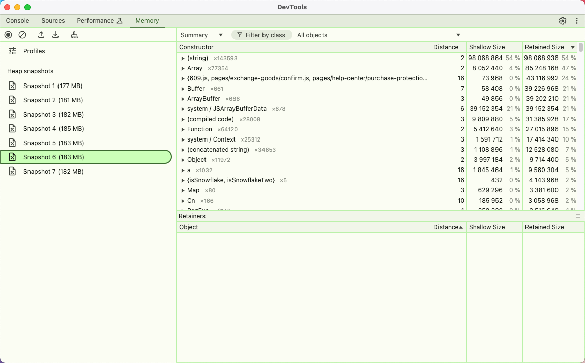

# pm2不断重启排查

【p0】pc端进程重启

## 一、问题：pm2 list 显示进程不断重启


## 二、解决办法

本地打包查看内存情况

1、新增.env.development.debug文件

```plain
# just a flag
NUXT_APP_ENV = 'development.debug'

# base api
BASE_URL = 'https://frontapi.homary.com'
SERVER_URL = 'https://frontapi.homary.com'
AFFIRM_PUBLIC_API_KEY='J2XNLIG13Z64VEV6'
AFFIRM_BASE_URL='https://www.affirm.com/js/v2/affirm.js'
PAY_BASE_URL = 'https://payment.homary.com'
ABTEST_REQUEST_URL = 'https://abtest-aws-us-east-01.saas.sensorsdata.com/api/v2/abtest/online/results?project-key=8F3586E00B909A651210D3DA6AC52EDC6701998A'


#第三方登录app ID
GOOGLE_APP_ID = '1053109877152-ftqj3guk5l60qi0c4o04260djptaro5c.apps.googleusercontent.com'
FB_APP_ID = '323056598293129'

#本地开发切换站点 (可以在此切换站点)
LOCAL_HOST_NAME = 'www.homary.com'

```
 
2、package.json 新增打包命令

```plain
		"build:debug": "node ./generate-version.js && cross-env NODE_ENV=development.debug nuxt build",
		"debug": "cross-env NODE_ENV=development.debug node --inspect  node_modules/.bin/nuxt start",
		"start:debug": "rm -rf node_modules && yarn install && npm run build:debug && npm run debug"
```
 
3、启动

```plain
npm run start:debug
```
 


4、检测内存

chrome://inspect/#devices


未访问localhost:3000前打1次内存快照

访问localhost:3000后打第2次快照

关闭localhost:3000标签后打第三次快照

访问localhost:3000后打第4次快照

关闭localhost:3000标签后打第5次快照

访问localhost:3000后打第6次快照

关闭localhost:3000标签后打第7次快照


内存不断增加，查看第5和弟6次之间分配的内存

点击具体实例，点击对应的文件

查看对应代码的情况


发现是layouts/error.vue的computed中调用了setInterval 没清除

## 三、修复

computed 中注释`handleCountDown方法`

改为mounted中调用


## 四、修复成功后pm2 list 显示重启为0，内存没有飙升




## 五、总结

内存泄漏代码上就那些点～

1、事件监听器：如果在组件中添加了事件监听器，但在组件销毁时没有移除它们，可能会导致内存泄漏。

2\. 定时器和异步操作：使用 setTimeout 或 setInterval 时，如果没有在组件销毁时清除这些定时器，也会导致内存泄漏。

3\. 未清理的引用：在 Vue 组件中，如果有对 DOM 元素或其他对象的引用，而这些引用在组件销毁时没有被清理，可能会导致内存泄漏。

4\. Vuex 状态管理：如果在 Vuex 中存储了大量数据，而这些数据在不再需要时没有被清理，也可能导致内存泄漏


## 六、参考链接

 [排查 Nuxt.js服务器端内存泄漏问题（Nuxt 3同理）](https://juejin.cn/post/7228834021152473145)

 [https://juejin.cn/post/7228834021152473145](https://juejin.cn/post/7228834021152473145) 

 [https://developer.chrome.com/docs/devtools/memory?hl=zh-cn](https://developer.chrome.com/docs/devtools/memory?hl=zh-cn) 

 [https://www.ruanyifeng.com/blog/2018/12/git-bisect.html](https://www.ruanyifeng.com/blog/2018/12/git-bisect.html) 


