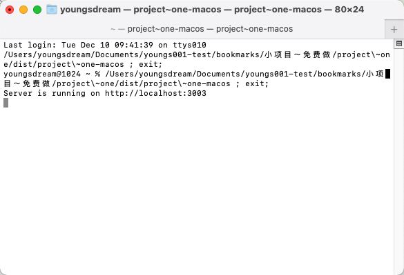

# 小项目～免费做

## 项目一：文件目录转Excel

### 项目背景

* 周末小舅子在加班。他是一个林业人员，在山林中装了很多拍摄设备，需要将设备中的信息整理出来。
* 周六他花了一天复制粘贴，打开文件夹，再打开子文件夹，复制文件的文件名，文件类型，创建时间，到excel文件。
*奈何文件夹太多，文件太多，复制粘贴太慢了。
* 晚饭的时候他给我说，有没有程序能将文件夹下的所有文件信息，包括文件名、文件大小、文件创建时间、文件修改时间、文件路径等，整理成一个Excel文件。
* 我一想，这还不简单，于是就给他写了一个程序。

### 项目需求

* 需要将一个文件夹下的所有文件信息，包括文件名、文件大小、文件创建时间、文件修改时间、文件路径等，整理成一个Excel文件。

### 项目需求分析

+ 读取指定路径下的文件夹下的所有一级文件夹，页面选择需要的文件夹
+ 循环读取一级文件夹中的文件信息（排除文件夹。只需要文件）输出到Excel
+ Excel的信息包括文件夹、文件名、文件类型、创建时间
+ 指定文件夹读取命令行的path 参数
+ 使用nodejs

### 项目实现

```
// file: readFilesToExcel.js
const fs = require('fs');
const path = require('path');
const xlsx = require('xlsx');

function readFilesToExcel(dirPath) {
    const workbook = xlsx.utils.book_new();
    const data = [];

    // 读取指定路径下的所有一级文件夹
    const folders = fs.readdirSync(dirPath).filter(file => {
        return fs.statSync(path.join(dirPath, file)).isDirectory();
    });

    // 循环读取一级文件夹中的文件信息
    folders.forEach(folder => {
        const folderPath = path.join(dirPath, folder);
        const files = fs.readdirSync(folderPath).filter(file => {
            return fs.statSync(path.join(folderPath, file)).isFile();
        });

        files.forEach(file => {
            const filePath = path.join(folderPath, file);
            const stats = fs.statSync(filePath);
            data.push({
                文件夹: folder,
                文件名: file,
                文件类型: path.extname(file),
                创建时间: stats.mtime
            });
        });
    });

    // 将数据写入 Excel
    const worksheet = xlsx.utils.json_to_sheet(data);
    xlsx.utils.book_append_sheet(workbook, worksheet, '文件信息');
    xlsx.writeFile(workbook, '文件信息.xlsx');
}

// 从命令行获取路径参数
const dirPath = process.argv[2];
if (!dirPath) {
    console.error('请提供文件夹路径作为参数');
    process.exit(1);
}

readFilesToExcel(dirPath);
```

### 项目交付

* 程序打包发送给小舅子，给他安装nodejs，在命令行中运行程序，输入文件夹路径，程序会自动将文件夹下的所有文件信息整理成一个Excel文件。``` node readFilesToExcel.js /path/to/your/folder ```
* 打开Excel文件，小舅子很满意，说可以节省很多时间。
* 简单给他说了一下怎么用


### 项目跟进

* 第二天小舅子说，程序用不了，我一瞅，原来他命令之中没给空格，导致程序报错。``` node readFilesToExcel.js/path/to/your/folder ```

### 项目迭代

+ 这项目对非程序猿太不友好了，需要改进，程序应该是一点就能用
+ 需要改进的地方：
    + 首先不能安装nodejs
    + 接着不能让他输入命令行
    + 应该是一个exe，一点就能用

### 项目迭代实现

1、读取指定路径下的文件夹下的所有一级文件夹，页面选择需要的文件夹

2、循环读取一级文件夹中的文件信息（排除文件夹。只需要文件）输出到Excel

3、Excel的信息包括文件夹、文件名、文件类型、创建时间

4、打包成exe可执行文件，打开后自动打开浏览器，输入文件夹路径，点击开始，自动生成Excel文件


### 项目迭代技术方案

1、使用koa2搭建一个web服务，提供一个页面，页面中有一个输入框，一个提交按钮

2、使用koa2搭建一个web服务，提供一个api，api接收文件夹路径，返回Excel文件

3、错误提示

4、使用 open自动打开浏览器

5、使用pkg打包成exe可执行文件




### 项目迭代交付

* 交付给小舅子，他很满意，说可以节省很多时间。
* 简单给他说了一下怎么用


## 项目总结

* 人应该做创新的是，简单明了的机械的工作交给程序。程序可以提高工作效率，节省时间。
* 这个项目让我意识到，程序员不仅要会写代码，还要会沟通，要站在用户的角度思考问题，要站在用户的角度思考问题，要站在用户的角度思考问题。

* 项目中使用到的技术栈：koa2、open、pkg、xlsx


